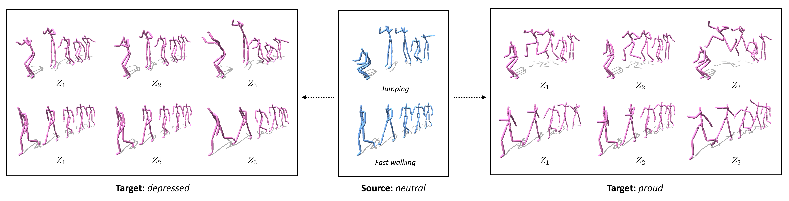
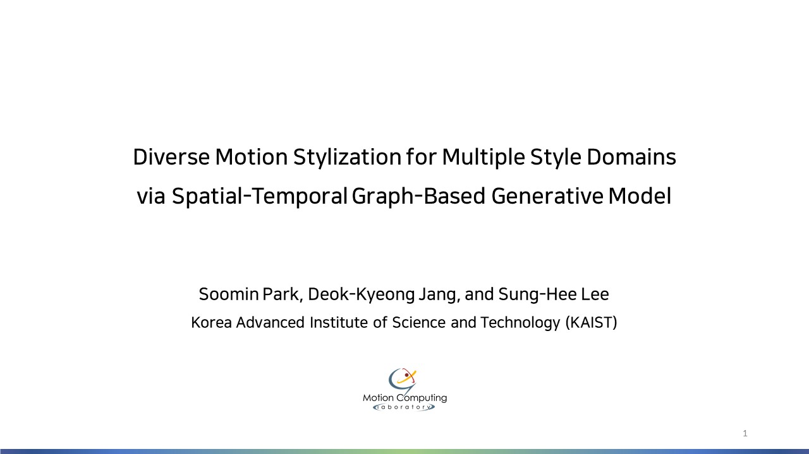
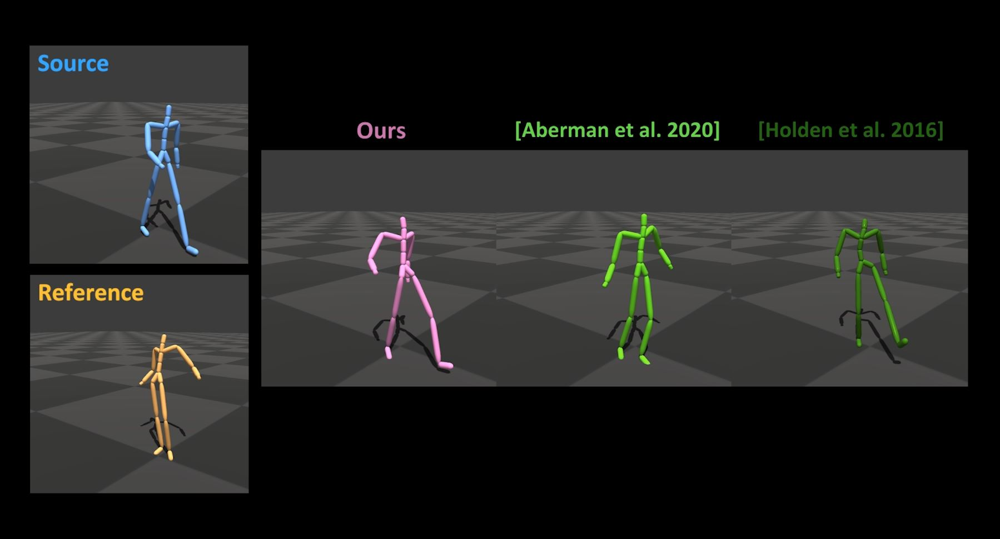

# Diverse Motion Stylization (Official)
This is the official Pytorch implementation of this [paper](https://dl.acm.org/doi/pdf/10.1145/3480145).



> **Diverse Motion Stylization for Multiple Style Domains via Spatial-Temporal Graph-Based Generative Model** \
> Soomin Park, Deok-Kyeong Jang, and Sung-Hee Lee \
> In The ACM SIGGRAPH / Eurographics Symposium on Computer Animation (SCA), 2021 \
> Appeared in: PACM on Computer Graphics and Interactive Techniques (PACMCGIT)

> Paper: https://dl.acm.org/doi/pdf/10.1145/3480145 \
> Project: http://lava.kaist.ac.kr/?page_id=6301

>**Abstract:** This paper presents a novel deep learning-based framework for translating a motion into various styles within multiple domains. Our framework is a single set of generative adversarial networks that learns stylistic features from a collection of unpaired motion clips with style labels to support mapping between multiple style domains. We construct a spatio-temporal graph to model a motion sequence and employ the spatial-temporal graph convolution networks (ST-GCN) to extract stylistic properties along spatial and temporal dimensions. Through spatial-temporal modeling, our framework shows improved style translation results between significantly different actions and on a long motion sequence containing multiple actions. In addition, we first develop a mapping network for motion stylization that maps a random noise to style, which allows for generating diverse stylization results without using reference motions. Through various experiments, we demonstrate the ability of our method to generate improved results in terms of visual quality, stylistic diversity, and content preservation.

## Abstract video
Click the figure to watch the teaser video. \
[](https://www.youtube.com/watch?v=iT9P0B8UpFs)

## Requirements
- matplotlib == 3.4.3
- numpy == 1.21.3
- scipy == 1.7.1
- torch == 1.10.0+cu113

## Installation
Clone this repository:
```
git clone https://github.com/soomean/Diverse-Motion-Stylization.git
cd Diverse-Motion-Stylization
```
Install the dependencies:
```
pip install -r requirements.txt
``` 

## Prepare data
1. Download the datasets from the following link: https://drive.google.com/drive/folders/1Anr9ouHSnZ80C9u2SB6X0f2Clzs4v7Dp?usp=sharing
2. Put them in the `datasets` directory

## Download pretrained model
1. `mkdir checkpoints`
2. Download the pretrained model from the following link: https://drive.google.com/drive/folders/1LBNddVo9A18FUz6y4LcA6vmIv3_Bm2QN?usp=sharing
3. Put it in the `checkpoints/[experiment_name]` directory

## Test pretrained model
```
python test.py --name [experiment_name] --mode test --load_iter 100000
```

## Train from scratch
```
python train.py --name [experiment_name]
```

## Supplementary video (full demo)
Click the figure to watch the supplementary video. \
[](https://youtu.be/2JPxMr6w3rM)

## Citation
If you find our work useful, please cite our paper as below:
```
@article{park2021diverse,
  title={Diverse Motion Stylization for Multiple Style Domains via Spatial-Temporal Graph-Based Generative Model},
  author={Park, Soomin and Jang, Deok-Kyeong and Lee, Sung-Hee},
  journal={Proceedings of the ACM on Computer Graphics and Interactive Techniques},
  volume={4},
  number={3},
  pages={1--17},
  year={2021},
  publisher={ACM New York, NY, USA}
}
```

## Acknowledgements
This repository contains code snippets of the following projects: \
https://theorangeduck.com/page/deep-learning-framework-character-motion-synthesis-and-editing
https://github.com/yysijie/st-gcn \
https://github.com/clovaai/stargan-v2 \
https://github.com/DeepMotionEditing/deep-motion-editing

## License
This work is licensed under the terms of the MIT license.

## Contact
If you have any question, please feel free to contact me (sumny@kaist.ac.kr).
